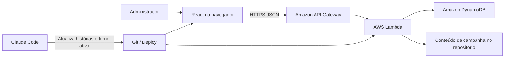

# Ravenloft: O Inverno dos Mortos
## Documento de campanha e especificação do site

**Status:** especificação inicial do MVP  
**Tecnologia principal:** React + TypeScript, API Gateway, AWS Lambda e Amazon DynamoDB  
**Modelo de operação:** os jogadores escolhem suas Casas e submetem uma carta por turno; o administrador consulta as escolhas; novos turnos e resultados são escritos manualmente no repositório com Claude Code e publicados em um novo deploy.

---

## 1. Visão geral

**O Inverno dos Mortos** é uma campanha cooperativa de estratégia narrativa inspirada em fantasia política e ambientada em um Domínio do Pavor compatível com Ravenloft.

Cada jogador controla uma Grande Casa, Guilda ou Ordem do Reino de Valdren. Em cada turno:

1. O jogador entra no site usando um código simples.
2. Lê o evento público do turno.
3. Lê uma informação privada relacionada à sua facção.
4. Recebe três cartas.
5. Escolhe uma carta.
6. A escolha é salva no DynamoDB.
7. O administrador entra com seu código e vê todas as escolhas.
8. O administrador usa Claude Code para escrever o resultado, criar o próximo turno e atualizar o site.
9. Um novo deploy publica o resultado e o próximo evento.

O site **não precisa conter antecipadamente todos os turnos da campanha**. O repositório contém somente:

- a introdução permanente;
- as Casas;
- os resultados já publicados;
- o turno atualmente ativo;
- opcionalmente, pequenos rascunhos privados que não são enviados ao frontend.

O inimigo central é um Lich desconhecido, chamado pelos sobreviventes de **Rei Pálido**. Ele surgiu no Norte, está reunindo um exército de mortos e descobriu uma forma de projetar seu poder através das Brumas.

---

## 2. Princípios do MVP

O MVP deve permanecer pequeno e fácil de manter.

### Incluído

- React com TypeScript.
- Seleção de Casa.
- Código simples de jogador gerado pelo servidor.
- Login por código.
- Uma Casa por jogador.
- Uma escolha de carta por Casa e por turno.
- Possibilidade de trocar a carta enquanto o turno estiver aberto.
- Persistência no DynamoDB.
- Página privada de cada jogador.
- Página de administrador.
- Visualização administrativa de todas as escolhas.
- Botão para copiar um resumo das escolhas.
- Bloqueio manual do turno pelo administrador.
- Conteúdo narrativo versionado no Git.
- Novos turnos publicados por alteração de código e deploy.

### Não incluído no MVP

- Cadastro por e-mail.
- Recuperação automática de senha.
- Chat entre jogadores.
- Combate automatizado.
- Inteligência artificial dentro do site.
- Geração automática de narrativa.
- Todos os turnos escritos antecipadamente.
- Aplicativo móvel nativo.
- Sistema complexo de inventário.
- Pagamentos.
- WebSockets ou atualização em tempo real.
- Mapas interativos.
- Integração direta do navegador com o DynamoDB.

---

## 3. Arquitetura recomendada

O navegador não deve conter credenciais da AWS nem acessar o DynamoDB diretamente. O React chama uma API HTTP; a API invoca uma função Lambda; a função valida o jogador e lê ou grava dados no DynamoDB.



### Componentes

#### Frontend

- React.
- TypeScript.
- Vite.
- React Router.
- CSS simples ou Tailwind CSS.
- `fetch` para chamadas HTTP.

#### Backend

- Node.js em AWS Lambda.
- Amazon API Gateway HTTP API.
- AWS SDK for JavaScript v3.
- `@aws-sdk/client-dynamodb`.
- `@aws-sdk/lib-dynamodb`.
- Uma função Lambda única pode atender todas as rotas no MVP.

#### Persistência

- Uma tabela DynamoDB.
- Billing mode `PAY_PER_REQUEST`.
- Point-in-time recovery recomendado.
- TTL opcional somente para sessões administrativas expiradas, não para escolhas.

#### Hospedagem

Opção mais simples:

- AWS Amplify Hosting para o frontend React.
- AWS SAM para API Gateway, Lambda e DynamoDB.

Alternativa:

- Amazon S3 + CloudFront para o frontend.
- AWS SAM ou CDK para o backend.

---

## 4. Separação entre conteúdo e estado

Esta decisão é essencial para o fluxo desejado.

### Conteúdo salvo no Git

O conteúdo narrativo deve ficar no repositório:

- introdução da campanha;
- descrições públicas das Casas;
- introduções privadas;
- evento público do turno;
- informações privadas do turno;
- cartas disponíveis;
- resultados publicados;
- identificador do turno ativo.

Exemplo:

```text
src/content/
  campaign.ts
  houses.ts
  turns/
    turn-001.ts
    turn-002.ts
```

### Estado salvo no DynamoDB

O DynamoDB guarda apenas o que muda com o uso:

- Casa reivindicada;
- nome opcional do jogador;
- hash do código de acesso;
- escolha de carta;
- horário da escolha;
- status aberto ou bloqueado do turno;
- eventos administrativos básicos.

Essa separação permite que Claude Code atualize a campanha sem precisar editar diretamente o DynamoDB.

---

# PARTE I — HISTÓRIA DA CAMPANHA

## 5. Título

# Ravenloft: O Inverno dos Mortos

---

## 6. Premissa

O Reino de Valdren está preso entre montanhas, mares congelados e as Brumas de Ravenloft.

Durante gerações, o Norte foi considerado uma região selvagem, habitada por pequenos clãs, fortalezas isoladas e tribos que raramente obedeciam à Coroa.

Então o inverno chegou cedo.

As primeiras fortalezas deixaram de enviar mensagens. Depois vieram os refugiados, contando que aldeias inteiras haviam sido destruídas por homens mortos.

Poucos acreditaram neles.

Agora, um exército de cadáveres avança para o sul.

No comando está uma figura conhecida apenas como **O Rei Pálido**.

Ninguém sabe quem ele é.

Alguns dizem que foi um antigo rei do Norte. Outros acreditam que seja um arquimago vindo de outro Domínio do Pavor. Há quem diga que ele nunca foi humano.

O que se sabe é que ele é um Lich.

Seu poder aumenta a cada pessoa morta. Os soldados que caem defendendo o reino levantam-se novamente para lutar ao lado dele.

Mais preocupante ainda: sua influência parece atravessar as Brumas.

Mortos-vivos de outros Domínios do Pavor começaram a aparecer em Valdren. Viajantes falam de cadáveres marchando dentro das próprias Brumas, seguindo estradas que não existem.

Isso deveria ser impossível.

---

## 7. Prólogo público para todos os jogadores

Durante quase trezentos anos, o Reino de Valdren sobreviveu cercado pelas Brumas.

Ao norte, montanhas cobertas de neve protegiam o reino das terras selvagens. Ao sul, navios navegavam por uma costa estreita antes de encontrarem a mesma parede branca e silenciosa. Estradas que entravam profundamente nas Brumas podiam retornar ao ponto de partida, desaparecer por semanas ou levar viajantes a lugares que não existiam em nenhum mapa.

Os habitantes de Valdren aprenderam a não questionar as fronteiras do mundo.

As Brumas estavam ali antes deles e provavelmente continuariam ali depois que todos estivessem mortos.

Por gerações, o maior perigo de Valdren não foi sobrenatural.

Foram as guerras entre nobres, as colheitas ruins, os invernos rigorosos, os impostos da Coroa e as antigas disputas entre as Grandes Casas. O reino cresceu fragmentado, sustentado por alianças frágeis e pela certeza de que nenhuma Casa conseguiria sobreviver sozinha.

Então o rei morreu.

O rei Edric III faleceu durante o último verão, depois de uma doença breve. Seu único filho, o príncipe Alaric, tem apenas nove anos. Até que alcance a idade necessária para assumir a Coroa, Valdren é governada pelo Conselho do Trono, formado pelas Casas e instituições mais poderosas do reino.

A princípio, a transição aconteceu sem guerra.

A Casa Valerius assumiu a regência. A Casa Vargen permaneceu responsável pela fronteira norte. A Casa Auremont garantiu o abastecimento das cidades. A Guilda do Ferro Negro continuou armando os soldados. A Ordem do Sino Pálido pediu calma à população. A Irmandade dos Corvos manteve as mensagens circulando entre regiões cada vez mais desconfiadas.

Então chegaram as primeiras notícias do Norte.

Uma aldeia desapareceu.

Depois, uma patrulha não retornou.

Uma fortaleza enviou uma mensagem afirmando que homens mortos estavam caminhando pela neve.

O Conselho considerou os relatos exagerados.

Os lordes do sul acreditaram que a Casa Vargen estava tentando obter mais tropas. Mercadores afirmaram que os refugiados inventavam histórias para receber abrigo. Sacerdotes disseram que o medo estava transformando bandidos em monstros nas histórias populares.

Quando a Fortaleza de Varn deixou de responder, ninguém enviou um exército.

Agora o inverno chegou três meses antes do esperado.

A neve já cobre estradas que deveriam permanecer abertas até o fim do outono. Rios começaram a congelar durante a noite. Corvos enviados ao norte retornam com penas brancas e mensagens que ninguém escreveu.

E milhares de pessoas caminham em direção ao sul.

Atrás delas vem um exército.

Não é um exército de invasores.

É um exército de mortos.

Eles marcham sob os estandartes das fortalezas que destruíram. Entre eles estão soldados desaparecidos, camponeses enterrados durante o último inverno e guerreiros que morreram muitas gerações atrás.

No comando está uma figura que os sobreviventes chamam de **Rei Pálido**.

Ninguém sabe seu verdadeiro nome.

Alguns dizem que ele é um antigo rei do Norte que retornou para reclamar Valdren.

Outros afirmam que é um feiticeiro vindo de além das Brumas.

Os poucos estudiosos que compreendem a natureza da criatura usam uma palavra mais antiga:

**Lich.**

Seu exército cresce a cada batalha. Os soldados que morrem enfrentando os mortos levantam-se novamente antes do amanhecer.

E algo ainda mais impossível está acontecendo.

O poder do Rei Pálido parece atravessar as Brumas.

Criaturas de terras desconhecidas surgem entre suas fileiras. Cadáveres usam moedas, armaduras e símbolos que nunca foram vistos em Valdren. Alguns mortos falam línguas que nenhum sábio consegue identificar.

O Conselho ainda não sabe quem é o inimigo.

Não sabe de onde ele veio.

Não sabe onde está seu filactério.

E não sabe por que ele escolheu Valdren.

Sabe apenas que o Norte está caindo.

E que, se as Grandes Casas não agirem juntas, cada soldado perdido tornará o inimigo ainda mais forte.

---

## 8. O Reino de Valdren

### 8.1 As Marcas do Norte

Uma região de montanhas, florestas de pinheiros e fortalezas isoladas.

É controlada principalmente pela Casa Vargen.

As Marcas protegem o restante do reino, mas possuem pouca agricultura e dependem de provisões enviadas pelo sul.

A Fortaleza de Varn era a principal defesa da Estrada Branca. Sua queda deixa o caminho aberto para o interior do reino.

### 8.2 Os Campos Dourados

As terras mais férteis de Valdren.

São controladas pela Casa Auremont e produzem a maior parte dos cereais, vegetais e animais usados para alimentar a população.

Os Campos Dourados não possuem grandes muralhas. Caso o exército do Rei Pálido alcance a região, o reino poderá perder seus alimentos antes mesmo de perder a guerra.

### 8.3 O Vale da Coroa

A região central do reino.

Ali ficam a capital, grandes cidades, estradas comerciais e as propriedades da Casa Valerius.

A capital, Asterhall, é cercada por muralhas antigas e abriga o jovem príncipe Alaric.

### 8.4 As Montanhas de Ferro

Região de minas, pedreiras e cidades industriais.

A Guilda do Ferro Negro controla a maior parte das minas e oficinas. Quase todas as armas, ferramentas e peças de metal usadas em Valdren passam por suas mãos.

### 8.5 A Costa das Brumas

Uma faixa de portos, pequenas cidades e estradas próximas às fronteiras nebulosas do domínio.

A região é essencial para o comércio interno e para o transporte de mensagens.

Também é onde a Irmandade dos Corvos possui sua maior influência.

---

## 9. Estado inicial do reino

| Indicador | Valor | Descrição |
|---|---:|---|
| Provisões | 6/10 | Há reservas, mas um inverno prolongado pode esgotá-las. |
| Força Militar | 5/10 | O reino consegue defender algumas regiões, não todas. |
| Unidade | 5/10 | As facções cooperam, mas não confiam plenamente umas nas outras. |
| Ordem Pública | 6/10 | A população ainda acredita que o Conselho mantém o controle. |
| Conhecimento sobre o Inimigo | 0/10 | Quase nada se sabe sobre o Rei Pálido. |
| Avanço dos Mortos | 1/10 | O inimigo atravessou a primeira linha de fortalezas. |

Esses indicadores são inicialmente narrativos. O site pode mostrar os números para facilitar o MVP. Em uma versão futura, alguns valores podem aparecer apenas como estados: estável, preocupante, crítico ou colapso.

---

# PARTE II — FACÇÕES

## 10. Casa Vargen — Os Lobos do Norte

### Introdução pública

A Casa Vargen governa as Marcas do Norte há mais de duzentos anos.

Seus soldados defendem as passagens das montanhas, protegem aldeias isoladas e mantêm as fortalezas que separam o coração de Valdren das terras selvagens.

Os Vargen não são a Casa mais rica nem a mais influente. Seus castelos são austeros, seus campos produzem pouco e seus exércitos dependem dos alimentos enviados pela Casa Auremont.

Entretanto, nenhuma outra Casa conhece melhor as estradas, as montanhas e os perigos do Norte.

O símbolo da Casa é um lobo cinzento diante de uma montanha branca.

**Lema:** “Primeiro a muralha. Depois o homem.”

### Líder

**Lady Elira Vargen**, senhora da Fortaleza de Droskar e comandante das forças do Norte.

Elira assumiu a liderança depois que seu marido e seu irmão morreram durante conflitos separados na fronteira. É respeitada por seus soldados, mas considerada fria e inflexível pelos nobres do sul.

### Força

Exército experiente, fortalezas e conhecimento do terreno.

### Fraqueza

Poucos alimentos, pouca riqueza e tropas já desgastadas.

### Interesse público

Impedir que o Norte seja abandonado.

### Introdução privada

Você é Lady Elira Vargen.

Durante dois meses, enviou mensagens ao Conselho alertando sobre desaparecimentos no Norte.

Nenhuma resposta veio.

Quando a aldeia de Hollen foi encontrada vazia, você pediu cinquenta soldados. A Coroa enviou cinco investigadores.

Quando uma patrulha encontrou cadáveres caminhando na neve, você pediu autorização para convocar seus estandartes. A Casa Auremont recusou-se a fornecer provisões para uma mobilização baseada em rumores.

Quando Varn enviou sua última mensagem, você pediu que o reino evacuasse as aldeias próximas.

A Casa Valerius ordenou que a população permanecesse onde estava para evitar pânico.

Agora Varn caiu.

Um dos sobreviventes que chegou à sua fortaleza é seu sobrinho, Arlen Vargen. Ele comandava vinte homens na muralha oeste.

Arlen afirma que os mortos não atacaram imediatamente.

Eles cercaram a fortaleza e permaneceram imóveis durante três noites.

Na quarta noite, o portão principal foi aberto por dentro.

Arlen não sabe quem o abriu.

Ele afirma que alguns soldados ouviram vozes de parentes mortos chamando por eles do lado de fora da muralha.

Antes de fugir, Arlen viu uma figura montada em um cavalo morto, observando a fortaleza de uma colina.

A figura não carregava uma espada.

Carregava a coroa do antigo rei Halric V, desaparecida de seu túmulo há quase cento e cinquenta anos.

Você não sabe se o Rei Pálido é Halric.

Mas sabe que alguém abriu o túmulo real.

### Objetivo particular

Preservar pelo menos duas fortalezas do Norte até o fim da campanha.

### Preocupação

Caso as outras Casas recuem cedo demais, todo o Norte será transformado em parte do exército inimigo.

---

## 11. Casa Auremont — Os Senhores da Colheita

### Introdução pública

A Casa Auremont controla as terras mais produtivas de Valdren.

Seus campos alimentam a capital, suas caravanas abastecem os exércitos e seus celeiros determinam quanto tempo o reino pode resistir durante um cerco.

Os Auremont são conhecidos por evitar guerras sempre que possível. Sua influência vem do controle de recursos, não de grandes exércitos.

Muitos nobres acusam a Casa de usar a fome como instrumento político.

Os Auremont respondem que homens armados ainda precisam comer.

O símbolo da Casa é um veado dourado sobre um campo verde.

**Lema:** “Tudo vive da terra.”

### Líder

**Lorde Marius Auremont**, senhor dos Campos Dourados.

Marius é um administrador cuidadoso e conhecido por manter registros detalhados de toda colheita, rebanho e reserva. Ele não é covarde, mas acredita que uma guerra pode ser perdida meses antes da batalha, quando os alimentos são desperdiçados.

### Força

Alimentos, riqueza agrícola e influência entre a população rural.

### Fraqueza

Território amplo, pouca proteção e dependência de estradas seguras.

### Interesse público

Evitar que a guerra provoque fome em todo o reino.

### Introdução privada

Você é Lorde Marius Auremont.

Os relatórios públicos dizem que Valdren possui alimentos suficientes para atravessar o inverno.

Isso não é verdade.

A última colheita foi menor do que o esperado. Uma doença atingiu parte dos rebanhos e três celeiros foram destruídos por incêndios cuja origem ainda não foi explicada.

Se o reino mantiver o consumo atual, as reservas durarão aproximadamente quatro meses.

Se receber dezenas de milhares de refugiados, durarão menos de dois.

Você ocultou esses números porque sabe o que acontecerá quando a população descobrir.

Mercadores esconderão alimentos.

Nobres aumentarão seus estoques particulares.

A população saqueará celeiros antes que a fome realmente comece.

Existe outro problema.

Uma caravana enviada à Fortaleza de Varn retornou sem os condutores. Os cavalos chegaram sozinhos, puxando carroças vazias.

Dentro de uma delas, seus homens encontraram sacos de grãos cobertos de gelo.

Os grãos estavam quentes.

Durante a noite, raízes negras começaram a crescer de dentro dos sacos.

Você ordenou que tudo fosse queimado.

Na manhã seguinte, um de seus administradores desapareceu.

### Objetivo particular

Impedir que Provisões chegue a zero.

### Preocupação

O inverno pode não estar apenas destruindo os alimentos. Pode estar transformando-os.

---

## 12. Casa Valerius — O Sangue da Coroa

### Introdução pública

A Casa Valerius possui laços antigos com a família real.

Seus membros serviram como regentes, conselheiros, comandantes e diplomatas durante gerações. Depois da morte do rei Edric III, foi a Casa Valerius que assumiu a responsabilidade de proteger o príncipe Alaric e administrar Valdren.

Para seus aliados, os Valerius são a única força capaz de impedir uma guerra civil.

Para seus críticos, estão usando a infância do príncipe para controlar o reino.

O símbolo da Casa é uma coroa de prata sobre um fundo azul-escuro.

**Lema:** “O reino acima da Casa.”

### Líder

**Lady Celene Valerius**, regente de Valdren e protetora do jovem príncipe.

Celene é uma política habilidosa, respeitada por sua inteligência e temida por sua capacidade de transformar acordos em obrigações. Ela sabe que qualquer sinal de fraqueza pode levar outras famílias a disputar a Coroa.

### Força

Autoridade política, diplomacia e acesso à Guarda Real.

### Fraqueza

Depende da legitimidade da Coroa e precisa manter as outras Casas unidas.

### Interesse público

Preservar o reino e impedir que a crise destrua a regência.

### Introdução privada

Você é Lady Celene Valerius.

Sua responsabilidade é manter Valdren unido até que o príncipe Alaric possa assumir a Coroa.

Isso parece cada vez menos possível.

Os lordes do sul dizem que a ameaça foi criada pela incompetência da Casa Vargen. Alguns nobres querem retirar tropas da fronteira para proteger suas próprias terras.

A Guilda do Ferro exige pagamento antecipado para aumentar a produção de armas.

A Casa Auremont se recusa a revelar seus estoques verdadeiros.

A Ordem do Sino teme que uma declaração pública sobre mortos-vivos provoque pânico religioso.

E a Irmandade dos Corvos sabe mais do que admite.

Você possui ainda uma informação que não compartilhou com ninguém.

Três dias antes de morrer, o rei Edric ordenou que antigos documentos sobre a dinastia de Halric V fossem removidos dos arquivos reais.

O rei parecia assustado.

Ele lhe disse:

> Há nomes que as Brumas não esqueceram.

Depois de sua morte, os documentos desapareceram.

Na noite passada, você encontrou um deles sobre sua mesa.

Ninguém foi visto entrando em seus aposentos.

O documento descreve uma expedição real enviada ao Norte cento e cinquenta anos atrás. O comandante era o príncipe Othmar, irmão mais novo de Halric V.

A expedição nunca retornou.

O nome de Othmar foi posteriormente removido de todos os registros oficiais.

### Objetivo particular

Manter Unidade acima de dois e proteger o príncipe Alaric.

### Preocupação

O Rei Pálido pode possuir uma reivindicação antiga sobre a Coroa.

---

## 13. Guilda do Ferro Negro — Os Mestres das Fornalhas

### Introdução pública

A Guilda do Ferro Negro não é uma Casa nobre.

É uma confederação de mineradores, ferreiros, pedreiros, engenheiros e comerciantes que controla a maior parte da produção de armas e ferramentas de Valdren.

Sem a Guilda, muralhas não são reparadas, espadas não são forjadas e pontes destruídas não podem ser reconstruídas.

A nobreza depende da Guilda, mas raramente a trata como igual.

Os trabalhadores não esqueceram isso.

O símbolo da Guilda é um martelo negro diante de uma chama vermelha.

**Lema:** “O reino permanece onde o ferro resiste.”

### Líder

**Mestre Torren Krail**, primeiro-ferreiro e representante da Guilda no Conselho.

Torren nasceu em uma família de mineiros e conquistou sua posição ao organizar a reconstrução de uma cidade destruída por um desabamento. Ele respeita resultados, não títulos.

### Força

Armas, fortificações, engenharia e trabalhadores especializados.

### Fraqueza

Depende de minério, combustível e rotas de transporte.

### Interesse público

Preparar Valdren para uma guerra que poderá durar anos.

### Introdução privada

Você é Mestre Torren Krail.

Quando recebeu a primeira descrição dos mortos, não pensou em magia.

Pensou em equipamento.

Cadáveres congelados ainda podem ser quebrados. Armaduras antigas ainda possuem pontos fracos. Pontes ainda podem ser derrubadas e estradas ainda podem ser bloqueadas.

Entretanto, seus ferreiros descobriram algo preocupante.

Uma espada recuperada de um morto encontrado perto de Varn foi colocada em uma fornalha.

O metal não derreteu.

Quando o ferreiro tentou martelá-lo, a lâmina começou a emitir um som semelhante a uma voz distante.

Três trabalhadores afirmaram ter ouvido seus próprios nomes.

Um deles entrou na fornalha durante a noite e morreu queimado.

A espada permaneceu intacta.

O símbolo marcado em sua lâmina pertence a uma mina chamada Korven, fechada há mais de cem anos depois que os trabalhadores encontraram ruínas sob a montanha.

Os registros da Guilda indicam que a mina não deveria conter ferro.

Ainda assim, alguém retirou grandes quantidades de metal de lá.

### Objetivo particular

Manter Força Militar acima de dois e descobrir como destruir os soldados do Lich.

### Preocupação

O inimigo pode possuir armas que as fornalhas de Valdren não conseguem destruir.

---

## 14. Ordem do Sino Pálido — Guardiões dos Vivos e dos Mortos

### Introdução pública

A Ordem do Sino Pálido administra templos, hospitais, cemitérios e casas de acolhimento.

Seus sacerdotes registram nascimentos e mortes, cuidam dos feridos e conduzem os ritos funerários de quase toda a população.

Em tempos de paz, a Ordem aconselha a Coroa.

Em tempos de crise, pode transformar medo em esperança — ou em fanatismo.

O símbolo da Ordem é um sino prateado cercado por seis velas.

**Lema:** “Todo sino deve tocar uma última vez.”

### Líder

**Madre Ysabet Voss**, guardiã do Grande Templo de Asterhall.

Ysabet é conhecida por sua compaixão, mas também por não tolerar charlatães e superstições perigosas. Até recentemente, considerava as histórias sobre mortos caminhando uma reação coletiva ao medo.

Agora, seus próprios sacerdotes começaram a desaparecer dos cemitérios.

### Força

Hospitais, moral, influência popular e conhecimento sobre ritos funerários.

### Fraqueza

Pouco poder militar e divisões internas entre moderados e fanáticos.

### Interesse público

Impedir que o medo dos mortos destrua a sociedade dos vivos.

### Introdução privada

Você é Madre Ysabet Voss.

Durante toda a sua vida, ensinou que os mortos devem receber descanso.

Agora, sacerdotes do Norte enviam relatos de corpos desaparecendo de túmulos.

Você acreditava que os cemitérios estavam sendo saqueados.

Então recebeu uma carta do irmão Caldus, responsável pelo templo de Varn.

A mensagem dizia:

> Eles não despertam vazios. Eles se lembram.

Caldus afirmava que alguns mortos conheciam os nomes de familiares, repetiam orações e imploravam para ser queimados antes que uma voz assumisse o controle deles.

A carta termina abruptamente.

Junto dela veio uma pequena tira de tecido retirada das vestes de um cadáver.

O tecido pertence à Ordem do Sino Pálido.

Pelos registros do templo, o sacerdote que usava aquelas vestes morreu há sessenta e oito anos.

Você possui textos antigos sobre liches, mas a maior parte foi proibida pela Coroa. Segundo esses textos, um lich só pode ser destruído permanentemente caso seu filactério seja encontrado.

Entretanto, nenhum texto explica como um lich poderia controlar mortos através das Brumas.

### Objetivo particular

Aumentar Conhecimento sobre o Inimigo e impedir que o medo ou a desordem destruam a população.

### Preocupação

Os mortos podem manter parte de suas memórias e estar conscientes de tudo o que fazem.

---

## 15. Irmandade dos Corvos — Aqueles que Sabem Primeiro

### Introdução pública

A Irmandade dos Corvos controla mensageiros, informantes, guias, contrabandistas e espiões por todo o reino.

Ela começou como uma rede de entregadores criada para atravessar as estradas perigosas próximas às Brumas. Com o tempo, tornou-se uma organização capaz de descobrir segredos antes mesmo que seus proprietários percebam que os perderam.

As Casas utilizam seus serviços e, ao mesmo tempo, desconfiam dela.

O símbolo da Irmandade é um corvo negro carregando uma chave.

**Lema:** “Toda estrada conta uma verdade.”

### Líder

**Nera Corvin**, mestra dos mensageiros e representante da Irmandade.

Nera raramente revela tudo o que sabe. Ela acredita que informação só possui valor enquanto não estiver nas mãos de todos.

### Força

Espionagem, comunicação, infiltração e rotas clandestinas.

### Fraqueza

Poucos soldados e baixa confiança das demais facções.

### Interesse público

Descobrir quem é o Rei Pálido e como seu poder atravessa as Brumas.

### Introdução privada

Você é Nera Corvin.

Seus agentes estavam no Norte antes das primeiras fortalezas caírem.

Alguns trabalhavam como mercadores. Outros como soldados, criados e contrabandistas.

Quase todos desapareceram.

Um deles retornou.

Seu nome é Garran. Ele entrou na sede da Irmandade durante a madrugada e entregou um mapa das estradas ao norte de Varn.

Garran parecia normal, exceto pelo fato de não respirar.

Depois de entregar o mapa, disse:

> Ele encontrou uma estrada através dos mortos.

Então caiu.

O corpo estava congelado por dentro.

O mapa mostra rotas atravessando as Brumas e ligando Valdren a lugares desconhecidos. Em uma dessas regiões, há uma cidade cercada por muralhas e por milhares de cadáveres.

No centro do mapa, Garran desenhou uma torre.

Abaixo dela escreveu:

> O coração não está no Norte.

Você acredita que essa frase se refere ao filactério do Lich.

Se estiver correta, destruir seu exército não será suficiente.

### Objetivo particular

Descobrir três pistas sobre a identidade, o poder ou o filactério do Rei Pálido.

### Preocupação

O filactério pode estar escondido em Valdren.

---

# PARTE III — PRIMEIRO TURNO

## 16. Evento público: A Estrada de Varn

Ao amanhecer, os vigias da Fortaleza de Droskar avistam uma longa coluna de pessoas na Estrada Branca.

São sobreviventes da queda de Varn.

Mais de dois mil homens, mulheres e crianças caminham para o sul. Muitos estão feridos. Alguns carregam crianças pequenas. Outros arrastam carroças vazias.

Atrás deles, a menos de um dia de distância, marcha uma força de aproximadamente quinhentos mortos.

Os inimigos avançam lentamente, mas não descansam.

A tempestade que se aproxima deve alcançar a estrada antes do anoitecer. Quando isso acontecer, a visibilidade será quase inexistente e a temperatura poderá matar qualquer pessoa sem abrigo.

A ponte sobre o Rio Keld é a única passagem rápida para o sul.

Caso a ponte seja destruída, os mortos serão atrasados por vários dias.

Porém, nem todos os refugiados conseguirão atravessar a tempo.

A Fortaleza de Droskar pode receber aproximadamente oitocentas pessoas sem comprometer completamente suas reservas. A cidade de Harrow, dois dias ao sul, pode receber o restante, desde que alimentos e escolta sejam enviados.

Há ainda um problema.

Entre os refugiados existem soldados de Varn.

Alguns estão gravemente feridos.

Um deles morreu durante a madrugada.

Ao nascer do sol, seu corpo desapareceu.

O Conselho precisa agir antes do anoitecer.

---

## 17. Informações privadas do Turno 1

### Casa Vargen

Arlen Vargen reconhece um dos oficiais entre os refugiados. O homem afirma ter escapado de Varn, mas Arlen viu seu corpo ser colocado na cripta dois dias antes da queda da fortaleza.

### Casa Auremont

Os cálculos indicam que alimentar todos os refugiados por apenas sete dias consumirá quase um décimo das reservas disponíveis para o inverno.

### Casa Valerius

Um mensageiro afirma portar uma ordem assinada pelo falecido rei Edric. A ordem determina que a ponte permaneça aberta, independentemente das perdas.

### Guilda do Ferro Negro

As correntes de sustentação da Ponte do Keld estão mais frágeis do que os registros indicam. Ela pode não suportar simultaneamente uma multidão, carroças e combate.

### Ordem do Sino Pálido

Um curador encontrou marcas de gelo sob a pele de três soldados feridos. Os homens ainda estão vivos, mas não possuem pulso perceptível.

### Irmandade dos Corvos

Um agente infiltrado entre os refugiados ouviu a mesma frase repetida por diferentes pessoas durante o sono: “Abram o caminho para aquele que não pode atravessar.”

---

## 18. Cartas iniciais da Casa Vargen

### Defender a Ponte

**Categoria:** Militar

Envie soldados para manter a ponte aberta até que o maior número possível de refugiados atravesse.

**Contribuição:** aumenta a Proteção da Retirada e mantém a ponte aberta por mais tempo.

**Risco:** sem apoio militar ou logístico, a Casa Vargen perde tropas.

### Recuar para Droskar

**Categoria:** Militar e Logística

Abandone a estrada e concentre suas forças na fortaleza.

**Contribuição:** fortalece Droskar e reduz a possibilidade de perda militar imediata.

**Risco:** centenas de refugiados ficam sem proteção e a Ordem Pública pode cair.

### Destruir a Ponte

**Categoria:** Sacrifício

Derrube a ponte assim que a maior parte de suas tropas atravessar.

**Contribuição:** atrasa imediatamente os mortos e protege Droskar de um ataque direto.

**Risco:** refugiados ainda no Norte são abandonados e a Unidade pode cair.

---

## 19. Cartas iniciais da Casa Auremont

### Enviar Caravanas de Alimentos

**Categoria:** Logística

Envie comida, cobertores e combustível para Droskar.

**Contribuição:** ajuda a abrigar os refugiados e impede uma perda adicional provocada pelo caos.

**Custo:** Provisões diminuem após a resolução.

### Preservar as Reservas

**Categoria:** Administração

Recuse o envio imediato e prepare os celeiros para um inverno prolongado.

**Contribuição:** protege os alimentos dos turnos futuros.

**Risco:** não ajuda a crise atual e pode reduzir a Ordem Pública.

### Desviar os Refugiados para Harrow

**Categoria:** Logística e Política

Envie mensageiros e guias para conduzir parte dos refugiados diretamente à cidade de Harrow.

**Contribuição:** reduz a pressão sobre Droskar e ajuda a acomodar a população.

**Risco:** sem escolta militar, a coluna pode ser atacada na estrada.

---

## 20. Cartas iniciais da Casa Valerius

### Mobilizar a Guarda Real

**Categoria:** Militar e Política

Envie tropas da capital para proteger a retirada.

**Contribuição:** aumenta a Proteção da Retirada e reforça a autoridade do Conselho.

**Custo:** a defesa da capital fica temporariamente reduzida.

### Ordenar a Destruição da Ponte

**Categoria:** Política e Sacrifício

Use a autoridade da Coroa para ordenar que a ponte seja destruída antes da chegada dos mortos.

**Contribuição:** garante o atraso do exército inimigo.

**Risco:** a Casa Valerius será publicamente responsabilizada pelos refugiados abandonados.

### Declarar Estado de Emergência

**Categoria:** Política

Conceda ao Conselho poderes para requisitar alimentos, tropas e acomodações.

**Contribuição:** ajuda a abrigar os refugiados e fortalece uma ação logística aliada.

**Risco:** a Ordem Pública cai se outra Casa rejeitar a autoridade da Coroa.

---

## 21. Cartas iniciais da Guilda do Ferro Negro

### Fortificar a Ponte

**Categoria:** Engenharia e Militar

Envie engenheiros para reforçar a ponte e preparar barricadas.

**Contribuição:** ajuda a retirada e atrasa os mortos mesmo que a ponte permaneça aberta.

**Custo:** materiais e trabalhadores ficam indisponíveis no próximo turno.

### Preparar a Demolição

**Categoria:** Engenharia e Sacrifício

Instale cargas e pontos de ruptura para destruir a ponte no momento escolhido.

**Contribuição:** permite destruir a ponte depois da passagem de mais refugiados.

**Risco:** sem proteção militar, os engenheiros podem morrer.

### Examinar as Armas de Varn

**Categoria:** Investigação

Recolha armas e armaduras trazidas pelos soldados sobreviventes.

**Contribuição:** ajuda a descobrir como os mortos estão sendo equipados e controlados.

**Risco:** não contribui diretamente para a retirada.

---

## 22. Cartas iniciais da Ordem do Sino Pálido

### Examinar os Feridos

**Categoria:** Religião e Investigação

Envie sacerdotes e curadores para examinar os soldados de Varn.

**Contribuição:** pode identificar sinais de influência necromântica.

**Risco:** membros da Ordem podem ser atacados por infiltrados mortos.

### Abrir os Templos

**Categoria:** Apoio Popular e Logística

Transforme templos, hospitais e espaços protegidos em abrigos temporários.

**Contribuição:** ajuda a acomodar os refugiados e pode reduzir o medo.

**Custo:** a Ordem ficará sobrecarregada no próximo turno.

### Queimar os Mortos

**Categoria:** Religião e Sacrifício

Ordene que todos os cadáveres encontrados entre os refugiados sejam imediatamente queimados.

**Contribuição:** impede que novos mortos se levantem durante o turno.

**Risco:** aumenta o medo e provoca resistência das famílias.

---

## 23. Cartas iniciais da Irmandade dos Corvos

### Infiltrar-se entre os Refugiados

**Categoria:** Investigação

Envie agentes disfarçados para ouvir histórias e identificar contradições.

**Contribuição:** pode revelar quem abriu os portões de Varn.

**Risco:** não oferece proteção imediata à retirada.

### Encontrar uma Rota Alternativa

**Categoria:** Investigação e Logística

Use contrabandistas e guias para encontrar uma travessia menor sobre o Rio Keld.

**Contribuição:** ajuda a retirada e permite que parte dos refugiados escape mesmo que a ponte seja destruída.

**Risco:** a rota pode passar perto das Brumas.

### Espalhar a Notícia

**Categoria:** Política

Envie mensagens para todas as regiões descrevendo a queda de Varn e a chegada dos mortos.

**Contribuição:** facilita futuras mobilizações e impede que as Casas neguem publicamente a ameaça.

**Risco:** aumenta o medo e pode provocar pânico.

---

## 24. Regras administrativas do Turno 1

Os jogadores não veem necessariamente estas regras.

### Desafio A — Proteger a retirada

São necessárias duas contribuições militares ou logísticas.

Falha sugerida:

- centenas de refugiados morrem;
- Avanço dos Mortos aumenta;
- Ordem Pública diminui ou o medo aumenta.

### Desafio B — Alimentar e abrigar os refugiados

São necessárias duas contribuições de logística, administração ou apoio popular.

Falha sugerida:

- Provisões diminuem;
- Ordem Pública diminui;
- começam revoltas em Droskar.

### Desafio C — Investigar os soldados de Varn

São necessárias duas contribuições de investigação ou religião.

Sucesso sugerido:

- Conhecimento sobre o Inimigo aumenta;
- a pista sobre o Portão de Varn é publicada.

### Desafio D — Destino da ponte

O resultado depende das cartas escolhidas:

- duas ou mais escolhas favoráveis à destruição: a ponte é destruída;
- uma escolha de destruição mais Preparar a Demolição: destruição tardia e mais controlada;
- Fortificar ou Defender sem ordem de destruição: a ponte permanece aberta;
- decisões contraditórias sem coordenação: acidente, atraso ou destruição prematura.

### Primeira pista possível

Os sobreviventes fornecem versões contraditórias sobre a queda de Varn.

Os investigadores concluem que o portão não foi destruído. Ele foi aberto por um oficial com autoridade suficiente para retirar as barras internas.

Esse oficial era o comandante de Varn, Lorde Cassian Rorik.

Cassian morreu seis dias antes da abertura dos portões.

Seu corpo havia sido colocado na cripta da fortaleza.

Com investigação excepcional, o resultado acrescenta:

> Na noite anterior à queda, vários soldados afirmaram ter visto Cassian caminhando sobre as muralhas, ainda usando as roupas com as quais foi enterrado.

---

# PARTE IV — EXPERIÊNCIA DO USUÁRIO

## 25. Fluxo de entrada

### Novo jogador

1. Abre o site.
2. Vê o título e uma breve explicação.
3. Escolhe “Entrar com código” ou “Escolher uma Casa”.
4. Ao escolher uma Casa, vê as Casas ainda disponíveis.
5. Abre a descrição pública da Casa.
6. Confirma a escolha.
7. Informa um nome de exibição opcional.
8. O backend reivindica a Casa de forma atômica.
9. O backend gera um código, por exemplo `jogador-4K7P`.
10. O site mostra o código com destaque e avisa que ele será necessário nos próximos acessos.
11. O jogador entra automaticamente na área privada da Casa.

### Jogador existente

1. Abre o site.
2. Seleciona “Entrar com código”.
3. Digita seu código.
4. O backend valida o código.
5. O frontend recebe um token temporário.
6. O jogador entra na área de sua Casa.

### Regra de códigos

O exemplo `jogador1` é simples, mas facilmente adivinhável. Para manter a experiência simples e reduzir acesso acidental, o formato recomendado é:

```text
jogador-4K7P
```

ou:

```text
vargen-4K7P
```

O código deve:

- ser gerado no backend;
- possuir pelo menos quatro caracteres aleatórios;
- não ser colocado em logs;
- ser exibido integralmente somente no momento da criação;
- ser transformado em hash antes de ser salvo.

Para um grupo totalmente confiável e site não público, códigos sequenciais podem ser usados, mas isso deve ser uma configuração consciente.

---

## 26. Tela do jogador

A tela principal deve ser vertical e simples.

### Cabeçalho

- Título da campanha.
- Nome da Casa.
- Nome de exibição.
- Botão “Sair”.

### Estado do reino

Uma linha ou grade com:

- Provisões;
- Força Militar;
- Unidade;
- Ordem Pública;
- Conhecimento;
- Avanço dos Mortos.

### Resultado anterior

Exibido somente depois que um turno já foi resolvido.

- resultado público;
- consequência privada da Casa;
- alterações nos indicadores.

### Evento atual

- número e título do turno;
- narrativa pública;
- informação privada da Casa.

### Três cartas

Cada carta mostra:

- nome;
- categoria;
- descrição;
- contribuição;
- risco ou custo;
- botão “Escolher esta carta”.

### Escolha atual

Depois da seleção:

- carta escolhida;
- horário da escolha;
- texto “Sua escolha foi registrada”;
- botão “Trocar escolha”, enquanto o turno estiver aberto.

Quando o turno estiver bloqueado:

- a escolha não pode ser alterada;
- aparece “O Conselho está resolvendo o turno”.

---

## 27. Seleção de Casa

Mostrar as seis facções como uma lista ou grade.

Cada item deve apresentar:

- nome;
- subtítulo;
- lema;
- resumo de força;
- status “Disponível” ou “Escolhida”.

A introdução privada nunca deve ser enviada antes de a Casa ser reivindicada e o jogador estar autenticado.

A Casa reivindicada não pode ser escolhida por outro jogador.

A operação precisa ser atômica no backend para evitar que duas pessoas escolham a mesma Casa simultaneamente.

---

## 28. Tela administrativa

Rota sugerida:

```text
/admin
```

### Login

- campo de código administrativo;
- botão “Entrar”;
- nenhum código administrativo no bundle React.

### Visão geral

- turno ativo;
- status aberto ou bloqueado;
- número de Casas reivindicadas;
- número de escolhas recebidas;
- indicadores atuais.

### Jogadores

| Casa | Jogador | Registrado em | Status |
|---|---|---|---|
| Vargen | Tulio | data/hora | Escolheu |
| Auremont | — | — | Disponível |

### Escolhas do turno

| Casa | Carta escolhida | Categoria | Horário |
|---|---|---|---|

### Ações

- Bloquear turno.
- Reabrir turno.
- Copiar resumo para Claude Code.
- Opcional: limpar uma escolha específica.
- Opcional: resetar uma Casa e gerar novo código.

### Texto copiado

Exemplo:

```text
CAMPANHA: O Inverno dos Mortos
TURNO: 1 — A Estrada de Varn

ESCOLHAS:
- Casa Vargen: Defender a Ponte
- Casa Auremont: Enviar Caravanas de Alimentos
- Casa Valerius: Mobilizar a Guarda Real
- Guilda do Ferro Negro: Examinar as Armas de Varn
- Ordem do Sino Pálido: Examinar os Feridos
- Irmandade dos Corvos: Encontrar uma Rota Alternativa

ESTADO ANTES DO TURNO:
Provisões 6
Força Militar 5
Unidade 5
Ordem Pública 6
Conhecimento 0
Avanço dos Mortos 1
```

---

# PARTE V — MODELO TÉCNICO

## 29. Rotas do frontend

```text
/                 Landing page
/claim            Escolha de Casa
/login            Login do jogador
/game             Área privada do jogador
/admin            Login e dashboard administrativo
```

Rotas privadas devem redirecionar para `/login` quando não houver token válido.

---

## 30. Estrutura sugerida do repositório

```text
ravenloft-winter/
  frontend/
    src/
      api/
        client.ts
      components/
        CardChoice.tsx
        HouseCard.tsx
        KingdomStats.tsx
        LoadingState.tsx
      pages/
        LandingPage.tsx
        ClaimHousePage.tsx
        LoginPage.tsx
        GamePage.tsx
        AdminPage.tsx
      auth/
        playerSession.ts
        adminSession.ts
      types/
        campaign.ts
        api.ts
      App.tsx
      main.tsx
    package.json
    vite.config.ts
  backend/
    src/
      handler.ts
      router.ts
      auth/
        playerAuth.ts
        adminAuth.ts
        tokens.ts
      routes/
        publicRoutes.ts
        playerRoutes.ts
        adminRoutes.ts
      db/
        dynamo.ts
        players.ts
        choices.ts
        turns.ts
      types/
        domain.ts
    template.yaml
    package.json
  shared/
    campaign-content/
      campaign.ts
      houses.ts
      turns/
        turn-001.ts
      types.ts
  scripts/
    validate-content.ts
  README.md
```

Frontend e backend devem importar o conteúdo do diretório `shared/campaign-content` para evitar duplicação.

O backend decide quais campos podem ser devolvidos para cada jogador.

---

## 31. Tipos TypeScript

```ts
export type HouseId =
  | "vargen"
  | "auremont"
  | "valerius"
  | "iron-guild"
  | "pale-bell"
  | "ravens";

export type CardCategory =
  | "military"
  | "logistics"
  | "politics"
  | "administration"
  | "investigation"
  | "religion"
  | "engineering"
  | "popular-support"
  | "sacrifice";

export interface KingdomState {
  provisions: number;
  militaryStrength: number;
  unity: number;
  publicOrder: number;
  enemyKnowledge: number;
  undeadAdvance: number;
}

export interface HouseDefinition {
  id: HouseId;
  name: string;
  subtitle: string;
  motto: string;
  publicIntroduction: string;
  privateIntroduction: string;
  leaderName: string;
  strength: string;
  weakness: string;
  publicInterest: string;
  privateObjective: string;
  privateConcern: string;
}

export interface TurnCard {
  id: string;
  houseId: HouseId;
  title: string;
  categories: CardCategory[];
  description: string;
  contribution: string;
  risk?: string;
  cost?: string;
  adminTags: string[];
}

export interface HouseTurnContent {
  privateInformation: string;
  cardIds: [string, string, string];
}

export interface PublishedTurnResult {
  publicResult: string;
  stateAfter: KingdomState;
  houseResults: Partial<Record<HouseId, string>>;
  discoveries: string[];
}

export interface TurnDefinition {
  id: number;
  slug: string;
  title: string;
  publicEvent: string;
  stateBefore: KingdomState;
  houseContent: Record<HouseId, HouseTurnContent>;
  cards: TurnCard[];
  adminResolutionNotes: string;
  publishedResult?: PublishedTurnResult;
}

export interface CampaignDefinition {
  id: string;
  title: string;
  activeTurnId: number;
  introduction: string;
  initialState: KingdomState;
}
```

---

## 32. Conteúdo do turno ativo

Exemplo simplificado:

```ts
export const turn001: TurnDefinition = {
  id: 1,
  slug: "a-estrada-de-varn",
  title: "A Estrada de Varn",
  stateBefore: {
    provisions: 6,
    militaryStrength: 5,
    unity: 5,
    publicOrder: 6,
    enemyKnowledge: 0,
    undeadAdvance: 1,
  },
  publicEvent: `Ao amanhecer, os vigias...`,
  houseContent: {
    vargen: {
      privateInformation: `Arlen Vargen reconhece...`,
      cardIds: [
        "t001-vargen-defend-bridge",
        "t001-vargen-retreat",
        "t001-vargen-destroy-bridge",
      ],
    },
    auremont: {
      privateInformation: `Os cálculos indicam...`,
      cardIds: [
        "t001-auremont-send-food",
        "t001-auremont-save-reserves",
        "t001-auremont-divert-refugees",
      ],
    },
    valerius: {
      privateInformation: `Um mensageiro afirma...`,
      cardIds: [
        "t001-valerius-royal-guard",
        "t001-valerius-destroy-bridge",
        "t001-valerius-emergency",
      ],
    },
    "iron-guild": {
      privateInformation: `As correntes da ponte...`,
      cardIds: [
        "t001-iron-fortify",
        "t001-iron-demolition",
        "t001-iron-examine-weapons",
      ],
    },
    "pale-bell": {
      privateInformation: `Um curador encontrou...`,
      cardIds: [
        "t001-bell-examine-wounded",
        "t001-bell-open-temples",
        "t001-bell-burn-dead",
      ],
    },
    ravens: {
      privateInformation: `Um agente infiltrado...`,
      cardIds: [
        "t001-ravens-infiltrate",
        "t001-ravens-route",
        "t001-ravens-spread-news",
      ],
    },
  },
  cards: [],
  adminResolutionNotes: `Resolver retirada, abrigo, investigação e ponte.`,
};
```

---

## 33. Modelo da tabela DynamoDB

Tabela sugerida:

```text
ravenloft-game
```

Chaves:

```text
PK: string
SK: string
```

### Item de metadados da campanha

```json
{
  "PK": "CAMPAIGN#WINTER_DEAD",
  "SK": "META",
  "entityType": "campaign",
  "turnStatus": "OPEN",
  "updatedAt": "2026-07-17T20:00:00.000Z"
}
```

O identificador do turno ativo pode ser lido do conteúdo implantado. O DynamoDB precisa apenas registrar se o turno está aberto ou bloqueado.

### Item de Casa reivindicada

```json
{
  "PK": "CAMPAIGN#WINTER_DEAD",
  "SK": "HOUSE#VARGEN",
  "entityType": "houseClaim",
  "houseId": "vargen",
  "displayName": "Tulio",
  "playerCodeHash": "sha256-value",
  "claimedAt": "2026-07-17T20:01:00.000Z"
}
```

### Item para login do jogador

```json
{
  "PK": "PLAYER#<sha256-do-codigo>",
  "SK": "PROFILE",
  "entityType": "playerProfile",
  "campaignId": "winter-dead",
  "houseId": "vargen",
  "displayName": "Tulio",
  "createdAt": "2026-07-17T20:01:00.000Z"
}
```

### Item de escolha

```json
{
  "PK": "CAMPAIGN#WINTER_DEAD#TURN#001",
  "SK": "HOUSE#VARGEN",
  "entityType": "choice",
  "turnId": 1,
  "houseId": "vargen",
  "cardId": "t001-vargen-defend-bridge",
  "selectedAt": "2026-07-17T21:15:00.000Z",
  "updatedAt": "2026-07-17T21:15:00.000Z"
}
```

---

## 34. Operação atômica ao escolher uma Casa

Ao reivindicar uma Casa, o backend deve usar `TransactWriteItems`:

1. Criar o item `HOUSE#<HOUSE_ID>` somente se ele ainda não existir.
2. Criar o perfil `PLAYER#<HASH>`.

Condição sugerida no item da Casa:

```text
attribute_not_exists(PK) AND attribute_not_exists(SK)
```

Se a transação falhar porque a Casa já foi escolhida, devolver HTTP `409 Conflict`.

---

## 35. API HTTP

Base:

```text
/api
```

### Rotas públicas

#### `GET /api/campaign`

Retorna:

- título;
- introdução curta;
- estado público;
- turno ativo;
- status aberto ou bloqueado.

Não retorna informações privadas.

#### `GET /api/houses`

Retorna:

- descrição pública das Casas;
- disponibilidade;
- nunca retorna introduções privadas.

#### `POST /api/claim-house`

Body:

```json
{
  "houseId": "vargen",
  "displayName": "Tulio"
}
```

Resposta:

```json
{
  "playerCode": "vargen-4K7P",
  "playerToken": "signed-token",
  "houseId": "vargen"
}
```

#### `POST /api/player/login`

Body:

```json
{
  "playerCode": "vargen-4K7P"
}
```

Resposta:

```json
{
  "playerToken": "signed-token",
  "houseId": "vargen",
  "displayName": "Tulio"
}
```

### Rotas autenticadas do jogador

Header:

```text
Authorization: Bearer <playerToken>
```

#### `GET /api/player/me`

Retorna o perfil e a Casa.

#### `GET /api/player/game`

Retorna somente:

- introdução pública;
- introdução privada da Casa autenticada;
- resultado público anterior;
- resultado privado da Casa;
- evento público atual;
- informação privada atual;
- três cartas da Casa;
- escolha atual;
- estado do reino;
- status do turno.

O jogador nunca informa `houseId` nessa rota. O backend identifica a Casa pelo token.

#### `PUT /api/turns/:turnId/choice`

Body:

```json
{
  "cardId": "t001-vargen-defend-bridge"
}
```

Validações:

- token válido;
- turno solicitado é o turno ativo;
- turno está aberto;
- carta pertence à Casa autenticada;
- carta pertence ao turno;
- carta está entre as três opções da Casa.

A gravação pode substituir a escolha anterior enquanto o turno estiver aberto.

### Rotas administrativas

#### `POST /api/admin/login`

Body:

```json
{
  "adminCode": "codigo-secreto"
}
```

O backend compara o hash do código com `ADMIN_CODE_HASH`.

#### `GET /api/admin/dashboard`

Retorna:

- Casas e jogadores;
- turno ativo;
- status;
- todas as escolhas;
- indicadores;
- resumo pronto para copiar.

#### `POST /api/admin/turn/lock`

Bloqueia novas escolhas.

#### `POST /api/admin/turn/unlock`

Reabre as escolhas.

#### `DELETE /api/admin/turns/:turnId/choices/:houseId`

Opcional. Remove a escolha de uma Casa.

#### `POST /api/admin/houses/:houseId/reset`

Opcional. Libera a Casa e invalida o código antigo.

---

## 36. Tokens simples

Para evitar Cognito no MVP, o backend pode emitir tokens HMAC assinados.

Payload de jogador:

```json
{
  "type": "player",
  "campaignId": "winter-dead",
  "houseId": "vargen",
  "exp": 1780000000
}
```

Payload administrativo:

```json
{
  "type": "admin",
  "campaignId": "winter-dead",
  "exp": 1780000000
}
```

Requisitos:

- assinar com `TOKEN_SIGNING_SECRET`;
- validar assinatura e expiração em toda rota privada;
- nunca colocar o segredo no frontend;
- usar HTTPS;
- manter token em `sessionStorage` para o MVP;
- não registrar tokens em logs.

Esse modelo é adequado para um pequeno grupo confiável. Caso o site se torne público ou tenha dados sensíveis, substituir por Amazon Cognito.

---

## 37. Variáveis de ambiente do backend

```text
TABLE_NAME=ravenloft-game
CAMPAIGN_ID=winter-dead
ADMIN_CODE_HASH=<sha256>
TOKEN_SIGNING_SECRET=<segredo-longo-aleatorio>
ALLOWED_ORIGIN=https://seu-site.example.com
AWS_REGION=us-east-1
```

Nunca versionar:

- código administrativo;
- segredo dos tokens;
- credenciais AWS;
- valores de produção em `.env`.

---

## 38. Política IAM da Lambda

A função Lambda deve ter acesso somente à tabela do jogo.

Permissões necessárias:

- `dynamodb:GetItem`
- `dynamodb:PutItem`
- `dynamodb:UpdateItem`
- `dynamodb:DeleteItem`
- `dynamodb:Query`
- `dynamodb:TransactWriteItems`

Evitar:

```text
dynamodb:*
Resource: *
```

---

## 39. CORS

O API Gateway deve aceitar chamadas apenas do domínio do frontend em produção.

Durante desenvolvimento:

```text
http://localhost:5173
```

Em produção:

```text
https://<dominio-do-site>
```

Métodos:

```text
GET, POST, PUT, DELETE, OPTIONS
```

Headers:

```text
Content-Type, Authorization
```

---

## 40. Validação de segurança importante

O backend deve impedir os seguintes ataques ou erros:

- jogador solicitar conteúdo privado de outra Casa;
- jogador escolher uma carta que não está na sua mão;
- jogador escolher carta de outro turno;
- jogador alterar a escolha depois que o turno foi bloqueado;
- dois jogadores reivindicarem a mesma Casa;
- frontend receber o código administrativo;
- frontend receber todas as informações privadas;
- administrador usar uma rota sem token administrativo;
- código ou token aparecer em logs;
- uma atualização antiga do frontend enviar escolha para um turno novo.

---

# PARTE VI — FLUXO COM CLAUDE CODE

## 41. Como encerrar um turno

1. Todos os jogadores submetem suas cartas.
2. O administrador entra em `/admin`.
3. Confirma que todas as Casas ativas escolheram.
4. Clica em “Bloquear turno”.
5. Clica em “Copiar resumo”.
6. Cola o resumo no Claude Code junto desta instrução:

```text
Leia a especificação da campanha e o conteúdo do turno ativo.
Use as escolhas abaixo para resolver o turno.

Não altere escolhas salvas.
Crie:
1. resultado público;
2. resultado privado para cada Casa;
3. novo estado do reino;
4. pistas descobertas;
5. próximo evento público;
6. informação privada do próximo turno para cada Casa;
7. três novas cartas para cada Casa.

Atualize os arquivos de conteúdo.
Mantenha todos os resultados anteriores.
Incremente activeTurnId.
Não implemente resolução automática.
Execute validação de TypeScript e testes.
```

7. Claude Code atualiza o repositório.
8. O administrador revisa o texto.
9. O código é commitado e publicado.
10. O novo deploy mostra o resultado anterior e o próximo turno.
11. O status do turno precisa voltar a `OPEN`.

---

## 42. Como representar o resultado no arquivo do turno

Antes da resolução:

```ts
export const turn001 = {
  // ...
  publishedResult: undefined,
};
```

Depois da resolução:

```ts
export const turn001 = {
  // ...
  publishedResult: {
    publicResult: `A Guarda Real e os homens de Vargen...`,
    stateAfter: {
      provisions: 5,
      militaryStrength: 5,
      unity: 6,
      publicOrder: 5,
      enemyKnowledge: 1,
      undeadAdvance: 1,
    },
    houseResults: {
      vargen: `Seus soldados mantiveram a ponte...`,
      auremont: `As caravanas chegaram...`,
      valerius: `A presença da Guarda Real...`,
      "iron-guild": `A espada recuperada...`,
      "pale-bell": `Os feridos não possuem pulso...`,
      ravens: `Seus agentes descobriram...`,
    },
    discoveries: [
      `O portão de Varn foi aberto pelo comandante morto Cassian Rorik.`,
    ],
  },
};
```

O novo turno é criado em outro arquivo:

```text
turn-002.ts
```

E o manifesto muda:

```ts
activeTurnId: 2
```

---

## 43. Limpeza das escolhas entre turnos

Não apagar escolhas antigas.

Cada turno possui sua própria partição:

```text
CAMPAIGN#WINTER_DEAD#TURN#001
CAMPAIGN#WINTER_DEAD#TURN#002
```

Quando o novo conteúdo é publicado:

- o backend passa a aceitar escolhas apenas para o turno novo;
- escolhas antigas permanecem disponíveis para o administrador;
- os jogadores veem o resultado antigo como histórico.

O status `OPEN` ou `LOCKED` deve ser associado ao turno ativo. Uma implementação mais robusta pode salvar:

```json
{
  "PK": "CAMPAIGN#WINTER_DEAD#TURN#002",
  "SK": "META",
  "turnStatus": "OPEN"
}
```

Isso evita reutilizar o status do turno anterior.

---

## 44. Proteção contra incompatibilidade de deploy

Como o conteúdo do turno é implantado no frontend e no backend, os dois precisam usar a mesma versão.

Adicionar:

```ts
export const CONTENT_VERSION = "2026-07-17-turn-001";
```

O endpoint `/api/campaign` retorna `contentVersion`.

O frontend compara com sua versão compilada. Se houver diferença:

```text
A campanha foi atualizada. Recarregue a página.
```

Isso evita que um frontend antigo submeta uma carta que o backend novo não reconhece.

---

# PARTE VII — INTERFACE

## 45. Direção visual

O site deve ser simples, legível e atmosférico.

### Cores sugeridas

- fundo: cinza quase preto;
- superfícies: cinza frio;
- texto: branco envelhecido;
- destaque: vermelho escuro ou azul de inverno;
- bordas: cinza metálico.

### Tipografia

- fonte serifada apenas para títulos;
- fonte sem serifa para leitura e botões;
- tamanho confortável no celular.

### Regras

- sem animações pesadas;
- sem vídeo;
- sem música automática;
- sem imagens obrigatórias no MVP;
- cartões claros e grandes;
- todos os botões com estado de carregamento;
- confirmação antes de reivindicar uma Casa;
- confirmação visual depois de salvar escolha.

---

## 46. Componentes principais

### `HouseCard`

```ts
interface HouseCardProps {
  house: PublicHouse;
  available: boolean;
  onSelect: () => void;
}
```

### `CardChoice`

```ts
interface CardChoiceProps {
  card: TurnCard;
  selected: boolean;
  disabled: boolean;
  onSelect: () => void;
}
```

### `KingdomStats`

Mostra seis valores com rótulos.

### `PrivatePanel`

Componente visualmente distinto para deixar claro que o texto é exclusivo do jogador.

### `AdminChoiceTable`

Lista escolhas e permite copiar resumo.

---

## 47. Estados de interface obrigatórios

Toda página com API deve tratar:

- carregando;
- sucesso;
- erro recuperável;
- sessão expirada;
- nenhum turno publicado;
- Casa já escolhida;
- turno bloqueado;
- carta inválida;
- conflito de versão;
- ausência de conexão.

Mensagens de erro não devem revelar stack trace nem detalhes do DynamoDB.

---

# PARTE VIII — INFRAESTRUTURA

## 48. AWS SAM

Recursos mínimos no `template.yaml`:

- `AWS::Serverless::Function`
- `AWS::Serverless::HttpApi`
- `AWS::DynamoDB::Table`

Configuração da tabela:

```yaml
BillingMode: PAY_PER_REQUEST
AttributeDefinitions:
  - AttributeName: PK
    AttributeType: S
  - AttributeName: SK
    AttributeType: S
KeySchema:
  - AttributeName: PK
    KeyType: HASH
  - AttributeName: SK
    KeyType: RANGE
PointInTimeRecoverySpecification:
  PointInTimeRecoveryEnabled: true
```

A Lambda deve receber o nome da tabela via variável de ambiente.

---

## 49. Desenvolvimento local

### Frontend

```bash
cd frontend
npm install
npm run dev
```

### Backend

```bash
cd backend
npm install
sam build
sam local start-api
```

### DynamoDB local

Opcionalmente usar DynamoDB Local ou uma tabela separada de desenvolvimento.

Nunca apontar testes locais para a tabela de produção por padrão.

---

## 50. Testes mínimos

### Backend

- reivindicar Casa disponível;
- rejeitar Casa já reivindicada;
- login com código válido;
- rejeitar código inválido;
- jogador recebe apenas conteúdo da própria Casa;
- salvar escolha válida;
- rejeitar carta de outra Casa;
- substituir escolha enquanto aberto;
- rejeitar alteração quando bloqueado;
- admin vê todas as escolhas;
- jogador não acessa endpoint administrativo.

### Frontend

- lista Casas;
- mostra indisponibilidade;
- guarda token da sessão;
- renderiza três cartas;
- confirma escolha;
- impede seleção quando bloqueado;
- dashboard mostra escolhas recebidas.

### Conteúdo

Criar um script `validate-content.ts` para garantir:

- todas as seis Casas existem;
- cada Casa possui exatamente três cartas no turno;
- todos os IDs de cartas são únicos;
- todas as cartas referenciadas existem;
- o turno ativo possui conteúdo privado para todas as Casas;
- o resultado publicado possui estado válido entre zero e dez;
- o turno ativo não possui resultado publicado;
- turnos anteriores possuem resultado publicado.

---

# PARTE IX — CRITÉRIOS DE ACEITAÇÃO DO MVP

## 51. Jogador

- Um visitante consegue ver as Casas disponíveis.
- Um visitante consegue reivindicar uma Casa livre.
- O site gera um código simples.
- O código permite entrar novamente.
- O jogador vê somente a introdução privada de sua Casa.
- O jogador vê o evento público.
- O jogador vê exatamente três cartas.
- O jogador consegue selecionar uma carta.
- A escolha continua registrada depois de atualizar a página.
- O jogador consegue trocar sua escolha enquanto o turno está aberto.
- O jogador não consegue trocar depois do bloqueio.

## 52. Administrador

- O código administrativo não aparece no frontend.
- O administrador consegue entrar.
- O administrador vê quem escolheu cada Casa.
- O administrador vê todas as cartas selecionadas.
- O administrador consegue copiar o resumo.
- O administrador consegue bloquear e reabrir o turno.
- Um jogador comum não consegue acessar os dados administrativos.

## 53. Conteúdo

- Claude Code consegue adicionar um novo turno sem alterar a estrutura do banco.
- Um novo deploy mostra o resultado anterior.
- Um novo deploy mostra o novo evento e as novas cartas.
- Escolhas de turnos antigos permanecem no DynamoDB.
- O backend rejeita cartas que não pertencem à versão ativa do conteúdo.

---

# PARTE X — ORDEM DE IMPLEMENTAÇÃO

## 54. Fase 1 — Conteúdo e frontend estático

1. Criar projeto React com TypeScript e Vite.
2. Criar tipos compartilhados.
3. Adicionar campanha, Casas e Turno 1.
4. Criar Landing, seleção, login, jogo e admin com dados falsos.
5. Validar responsividade.

## 55. Fase 2 — Backend e DynamoDB

1. Criar template SAM.
2. Criar tabela.
3. Implementar roteamento Lambda.
4. Implementar geração e hash de códigos.
5. Implementar tokens.
6. Implementar reivindicação atômica.
7. Implementar login.
8. Implementar escolhas.

## 56. Fase 3 — Administração

1. Login administrativo.
2. Dashboard.
3. Bloqueio.
4. Resumo copiável.
5. Reset opcional.

## 57. Fase 4 — Deploy

1. Implantar backend.
2. Configurar CORS.
3. Implantar frontend.
4. Configurar variável `VITE_API_BASE_URL`.
5. Executar testes em produção.
6. Reivindicar Casas de teste e depois limpar a tabela.

---

# PARTE XI — PROMPT INICIAL PARA CLAUDE CODE

```text
Implemente o MVP descrito em ravenloft_inverno_dos_mortos_site_spec.md.

Requisitos obrigatórios:
- React, TypeScript e Vite no frontend.
- AWS API Gateway HTTP API, Lambda Node.js e uma tabela DynamoDB.
- O navegador nunca acessa DynamoDB diretamente.
- Conteúdo da campanha fica no repositório.
- Estado de jogadores e escolhas fica no DynamoDB.
- Seis Casas.
- Um jogador reivindica uma Casa e recebe um código simples gerado no backend.
- Login do jogador por código.
- Login administrativo por código mantido somente no backend.
- Cada Casa vê sua introdução privada, o evento público, sua informação privada e exatamente três cartas.
- Uma carta pode ser escolhida ou trocada enquanto o turno está aberto.
- Admin vê todas as escolhas, bloqueia o turno e copia um resumo.
- Não crie resolução automática.
- Não escreva turnos futuros.
- Implemente somente o Turno 1 contido no documento.
- Use AWS SDK JavaScript v3.
- Use TransactWriteItems para impedir duas reivindicações da mesma Casa.
- Adicione validação de conteúdo, testes essenciais e instruções de deploy.
- Mantenha o design simples, responsivo e legível.
```

---

# PARTE XII — OBSERVAÇÕES

## 58. Propriedade intelectual

Este projeto é uma campanha não oficial inspirada em Ravenloft e em fantasia política. Caso o site seja disponibilizado publicamente, incluir uma nota de projeto de fã e evitar usar imagens, logotipos ou textos copiados dos livros oficiais.

O domínio, as Casas, personagens e narrativa deste documento são originais.

## 59. Decisão mais importante

O site não é o mestre da campanha.

Ele é apenas:

- portal de leitura;
- seletor de decisões;
- armazenamento das escolhas;
- painel administrativo;
- histórico publicado.

A resolução continua humana, feita pelo administrador com apoio do Claude Code. Isso mantém a implementação simples e permite adaptar o enredo às decisões reais do grupo.

---

## 60. Referências técnicas oficiais

- AWS Serverless Multi-Tier Architectures: Web Application.
- Amazon API Gateway: tutorial de HTTP API com Lambda e DynamoDB.
- AWS SDK for JavaScript v3: DynamoDB Document Client.
- Amazon DynamoDB: práticas recomendadas de segurança e arquitetura.
